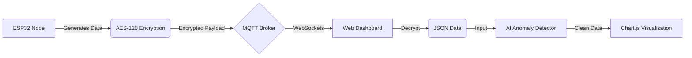

# Secure IoT Anomaly Detection System

A robust IoT monitoring solution that combines **AES-128 encryption**, **MQTT communication**, and **Browser-based AI Anomaly Detection**. This project demonstrates how to securely transmit sensor data from an ESP32 to a web dashboard and filter out anomalies in real-time using JavaScript.

## Project Overview

This system simulates a sensor node (ESP32) generating environmental data (Temperature, Humidity, Light). The data is encrypted on the device, transmitted via MQTT to a public broker, and received by a web dashboard. The dashboard decrypts the data and passes it through a lightweight AI model to detect and correct sensor anomalies before visualization.

### Architecture



## Key Features

- **End-to-End Security**: 
  - Data is encrypted using **AES-128 (ECB Mode)** on the ESP32.
  - Transmitted securely via MQTT.
  - Decrypted locally in the browser.
- **Real-Time Communication**:
  - Uses **MQTT over WebSockets** (HiveMQ) for low-latency data streaming.
  - Accessible from any network (Mobile/Desktop) without port forwarding.
- **Edge AI (Browser-Side)**:
  - **Z-Score Analysis**: Statistical method to identify outliers.
  - **Range Clamping**: Automatically corrects impossible sensor values.
  - **Zero-Dependency**: AI logic runs entirely in vanilla JavaScript (`ai_model.js`).
- **Responsive Dashboard**:
  - Modern UI with Dark Mode.
  - Real-time charts using **Chart.js**.
  - Live logs showing Encrypted vs. Decrypted data streams.

## Project Structure

```
├── src/
│   └── main.cpp           # ESP32 Firmware (C++)
│       ├── Data Generation
│       ├── AES-128 Encryption
│       └── MQTT Publisher
├── web_dashboard/
│   ├── index.html         # Main Dashboard Interface
│   └── js/
│       └── ai_model.js    # AI Anomaly Detection Logic
├── platformio.ini         # PlatformIO Configuration & Dependencies
└── ml_pipeline/           # (Deprecated) Python-based ML experiments
```

## Tech Stack

- **Hardware**: ESP32 Development Board
- **Firmware**: C++, PlatformIO, Arduino Framework
- **Libraries**: `PubSubClient` (MQTT), `mbedtls` (Encryption)
- **Frontend**: HTML5, CSS3, JavaScript (ES6+)
- **Visualization**: Chart.js
- **Protocol**: MQTT (Message Queuing Telemetry Transport)

## Getting Started

### Prerequisites
- VS Code with **PlatformIO** extension installed.
- An ESP32 Development Board.

### Installation

1. **Clone the Repository**
   ```bash
   git clone https://github.com/AmitSingh-2905/AQM_RP.git
   cd AQM_RP
   ```

2. **Flash the Firmware**
   - Open the project in VS Code.
   - Connect your ESP32 via USB.
   - Click the **PlatformIO Upload** button (arrow icon) or run:
     ```bash
     pio run --target upload
     ```
   - *Note: Ensure your WiFi credentials are set in `src/main.cpp`.*

3. **Launch the Dashboard**
   - Navigate to the `web_dashboard` folder.
   - Open `index.html` in any modern web browser (Chrome, Safari, Firefox).
   - Works on Mobile devices too!

## Usage

1. **Power on the ESP32**: It will connect to WiFi and start publishing encrypted data to `encryption_tls/data`.
2. **Open Dashboard**: Click the **"Connect"** button on the web interface.
3. **Monitor**:
   - **Graphs**: View real-time Temperature, Humidity, and Light levels.
   - **Logs**: Observe the raw encrypted string vs. the decrypted JSON.
   - **Anomalies**: Watch the AI correct spikes (simulated anomalies occur randomly).

## Security Details

- **Algorithm**: AES-128 (Advanced Encryption Standard).
- **Key Management**: Hardcoded 16-byte key (for demo purposes).
- **Transport**: MQTT over Secure WebSockets (WSS) on port 8884.

---
*Created by Amit Prasad Singh and Abhisek Beuria*
